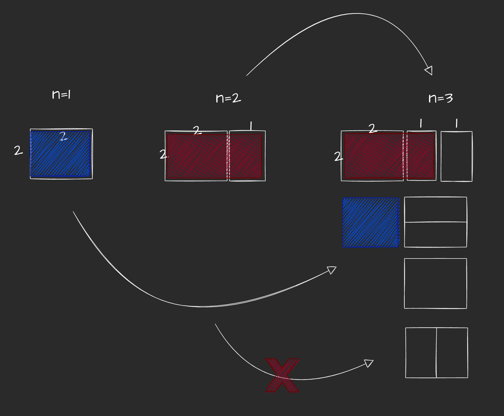

# 알고리즘 4주차 dp silver

## 1. 쉬운 계단수

* [쉬운 계단수 풀이](쉬운계단수/BJ10844.py)
  * [참조블로그](https://cotak.tistory.com/12)

### 1-1) 문제 요약

`45656` 과 같은 숫자가 있을 때, 해당 숫자는 모든 숫자가 1씩 차이가 나고, 해당 수를 계단수라고 한다.
숫자 n이 주어질 때, 게단수의 개수를 구하라.

### 1-2) 문제 풀이: 아이디어

* 실패
  * 처음에는 규칙성을 찾았을 때 다음과 같이 생각했다.
    * 1 ~ 9 가 있을 때, 앞뒤로 숫자가 +1, -1 붙을 수 있다.
    * 그렇기 때문에 경우의 수는 전의 항 *4인데, 반마다 중복으로 집계가 되므로 /2를 해준다. 그리고 0, 9 예외값에 대해서 -1을 해준다.
    * 그래서 `dp[i] = dp[i-1]*2-1` 이런식으로 생각했는데 틀렸다. 
    
* 풀이 생각
  * 나는 23 이렇게 숫자가 있으면 2앞으로 +1,-1 // 3뒤로 +1, -1 이렇게 생각했는데, 앞의 +1 -1은 **이미 지난 경우의 수에서 센 것**으로 counting을 해줘야 한다.
  * 그렇기 때문에 23의 경우 22, 24 이렇게 뒤 경우의 수 +1, -1 만 따져주면 된다.

### 1-3) 문제 풀이: 코드

* dp 테이블의 의미
  * dp테이블은 항상 테이블이 무엇을 의미하는 지 아는 것이 중요하다.
  * `dp[i][j]` 가 의미하는 것은 i자리수 일 때, 마지막 수가 j일 때 구성될 수 있는 경우의 수다.
    * ex) `dp[3][3]`
      * 123, 323, 543 등 자리수가 3이고 끝나는 수가 3일 때 만들어질 수 있는 경우의 수

* `dp[i][0]`의 값은 `dp[i-1][1]` 와 같다.
  * 왜냐하면 예를들어 9자리 수에서 끝자리가 0을 만들려면 8자리 수에서 끝자리가 1인 수에서 0을 붙이는 방법밖에 없기 때문이다. 
  * 마찬가지로`dp[i][9]`의 값은 `dp[i-1][8]` 에서 1을 더해준다.

* `dp[i][j]`의 값은 `dp[i-1][j-1] + dp[i-1][j+1]` 을 해준다.
  * 이는 만약 세 자리 수에서 끝 자리가 3인 수를 만들려면 두 자리 수에서 -2, -4 의 경우의 수를 더해줘야 되기 때문이다.

## 2. 이친수

* [이친수 풀이](./이친수/BJ2193.py)

### 2-1) 문제 요약

1, 10, 100, 101, 1000, 1001과 같이 뒤에 1은 연속으로 오지 않고, 0으로 시작하지 않는다.
n값이 주어졌을 때 경우의 수를 구하라.

### 2-2) 문제 풀이

* 항을 구하다 눈치로 피보나치라는 것을 알았는데, 정확한 근거로 추론하기는 힘들었다.
* 다음 항이 전에 항을 기반으로 쌓여나간다.
  * 이 때, 다음 항을 충족시키는 개수는 전의 항 2개를 더한 개수와 정확히 일치한다.
* 만약 예시를 1,2개밖에 구할 수 없고, 지금보다 일반항으로 추론해야 하는 문제였으면 구하기 힘들었을 것 같다.

## 3. 2xn타일링 2

### 3-1) 문제 요약

1*2, 2*1, 2*2 타일로 타일을 채울 수 있을 때, 타일을 채우는 경우의 수를 구하라.

### 3-2) 문제 풀이

* [종원이 풀이랑 같다](https://loosie.tistory.com/411)
* [2xn 타일링2 풀이](./2xn타일링2/BJ11727.py)

* 직전 항에서 1개, 직직전 항에서 2개가 나올 수 있다.
  * 이 때, 직직전 항에서 서서 2개가 더해지는 형태는 그림에서 보는 것처럼 직전 항에서 이미 세졌으므로 제외한다.

## 4. 다리놓기

* [다리놓기 풀이](./다리놓기/BJ1010.py)

### 4-1) 문제 요약

n -> m 연결을 할 때, 해당 경우의 수를 구하라.
([문제 링크](https://www.acmicpc.net/problem/1010)를 가서 그림을 보는게 빠름)

### 4-2) 문제 풀이

* 실버5인데, 생각보다 생각할게 많았다.

* 추가되는 경우의 수가 있을 때, 해당 수를 고를 때 / 해당 수를 고르지 않을 때를 나눈다.
  * dp는 항상 전의 항이 다음 항에 어떻게 영향을 주는 지를 살펴봐야한다.

* 만약 위 예제와 같이 3,4에서 3,5가 된다면 해당 추가된 숫자를 고르는 경우, 안 고르는 경우가 나눠지게 된다.
  * 즉, 3,4 = 3,3 + 2,4 인 것이다.
  * `dp[n][m] = dp[n-1][m-1] + dp[n][m-1]`

## 5. 카드 구매하기

* [카드 구매하기 풀이](./카드구매하기/BJ11052.py)

### 5-1) 문제 요약

4
1 5 6 7 과 같이 값이 주어졌을 때, 해당 값은 해당 index(1부터 시작)에 따른 value를 나타낸다.
`dp[n]`을 구하라.

### 5-2) 문제 풀이

* 전형적인 dp 대표문제라고 할 수 있다.
  * [coin change](https://leetcode.com/problems/coin-change/)와 같은 유형이다.

* `i <- 1 to N+1` , `j <- 1 to N+1` 하면서, `i-j >=0 ` 이라면 max값을 갱신해준다.